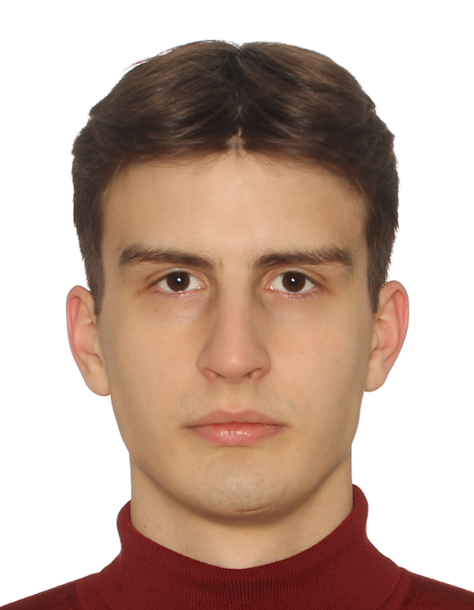

	

		<h2 style="margin: 0; font-size: 22px; font-weight: 700; color: #333;">
			Севастьянов Алексей Александрович
		</h2>
		

			📞 +7 (915) 365-77-99 |
			✉️ fordro00@mail.ru |
			
				<svg style="width:16px;height:16px;vertical-align:middle;margin-right:4px;" 
					 viewBox="0 0 24 24" fill="currentColor">
					<!-- Telegram logo -->
					<path d="M23.91 3.79L20.3 20.84c-.25 1.21-.98 1.5-2 .94l-5.5-4.07-2.66 2.57c-.3.3-.55.56-1.1.56-.72 0-.6-.27-.84-.95L6.3 13.7l-5.45-1.7c-1.18-.35-1.19-1.16.26-1.75l21.26-8.2c.97-.43 1.9.24 1.53 1.73z"/>
				</svg>
				<a href="https://t.me/FordRopesUseM" 
				   style="text-decoration: none; border-bottom: 1px solid #aaa; color: inherit;">
					@FordRopesUseM
				</a>
			 |
			
				<svg style="width:16px;height:16px;vertical-align:middle;margin-right:4px;" 
					 viewBox="0 0 24 24" fill="currentColor">
					<!-- GitHub cat logo -->
					<path d="M12,2A10,10 0 0,0 2,12C2,16.42 4.87,20.17 8.84,21.5C9.34,21.58 9.5,21.27 9.5,21C9.5,20.77 9.5,20.14 9.5,19.31C6.73,19.91 6.14,17.97 6.14,17.97C5.68,16.81 5.03,16.5 5.03,16.5C4.12,15.88 5.1,15.9 5.1,15.9C6.1,15.97 6.63,16.93 6.63,16.93C7.5,18.45 8.97,18 9.54,17.76C9.63,17.11 9.89,16.67 10.17,16.42C7.95,16.17 5.62,15.31 5.62,11.5C5.62,10.39 6,9.5 6.65,8.79C6.55,8.54 6.2,7.5 6.75,6.15C6.75,6.15 7.59,5.88 9.5,7.17C10.29,6.95 11.15,6.84 12,6.84C12.85,6.84 13.71,6.95 14.5,7.17C16.41,5.88 17.25,6.15 17.25,6.15C17.8,7.5 17.45,8.54 17.35,8.79C18,9.5 18.38,10.39 18.38,11.5C18.38,15.32 16.04,16.16 13.81,16.41C14.17,16.72 14.5,17.33 14.5,18.26C14.5,19.6 14.5,20.68 14.5,21C14.5,21.27 14.66,21.59 15.17,21.5C19.14,20.16 22,16.42 22,12A10,10 0 0,0 12,2Z"/>
				</svg>
				<a href="https://github.com/AlexGrom1989/Pet-Projects" 
				   style="text-decoration: none; border-bottom: 1px solid #aaa; color: inherit;">
					AlexGrom1989
				</a>
			
		

		 
		

			ML Engineer / Data Scientist с фокусом на компьютерном зрении, NLP и аналитике экспериментов. 
			Реализовал коммерческую end-to-end систему распознавания госномеров и выиграл X5-Tech хакатон,
			автоматизировав оценку стажёров. Вижу своё призвание в ML как области, где математическая строгость
			встречается с практическими бизнес-задачами и ищу позицию ML Engineer / Data Scientist в продуктовой
			или R&amp;D-команде.
		

	

	

		
	

<!-- Навыки -->
<h3 style="margin: 0; margin-top: 8px; font-size: 13px; text-transform: uppercase; letter-spacing: 0.08em; color: rgba(2,2,2,0.55);">
	Навыки
</h3>

<ul style="margin: 0 0 4px 16px; padding: 0; font-size: 13px; column-count: 2; column-gap: 24px;">
	<li>Python, PyTorch, Scikit-learn, CatBoost</li>
	<li>Computer Vision (YOLO, OCR, CRNN, OpenCV)</li>
	<li>NLP (BERT, ASR-пайплайны)</li>
	<li>A/B-тесты, статистика, ANOVA, t‑тесты</li>
	<li>SQL, PostgreSQL, Greenplum</li>
	<li>PySpark, S3, ETL-пайплайны</li>
	<li>Docker, Git, Bash/Linux</li>
	<li>BeautifulSoup, Telegram API</li>
</ul>

<!-- Опыт (коммерческий) -->
<h3 style="margin: 0; margin-top: 8px; font-size: 13px; text-transform: uppercase; letter-spacing: 0.08em; color: rgba(2,2,2,0.55);">
	Опыт работы
</h3>

	

		

			<strong>ML Engineer (проектная работа)</strong> — система контроля автотранспорта
		

		

			коммерческий проект
		

	

	<ul style="margin: 0 0 0 16px; padding: 0; font-size: 13px;">
		<li>Спроектировал end-to-end pipeline: детекция номеров на видео (<strong>YOLOv11</strong>), нормализация и распознавание (<strong>CRNN</strong> с <strong>ResNet18</strong>-энкодером).</li>
		<li>Достиг точности распознавания около <strong>97%</strong> на тестовой выборке за счёт аугментации данных и адаптивной предобработки изображений.</li>
		<li>Разработал desktop-приложение на <strong>PyQt</strong> для сотрудников охраны с журналом въездов и базой водителей.</li>
	</ul>

<!-- Проекты -->
<h3 style="margin: 0; margin-top: 8px; font-size: 13px; text-transform: uppercase; letter-spacing: 0.08em; color: rgba(2,2,2,0.55);">
	Проекты
</h3>

	<!-- X5-Tech Хакатон -->
	

		

			<strong>Оптимизация процесса найма стажёров (X5-Tech Хакатон) — 1 место</strong>
		

		

			NLP
		

	

	<ul style="margin: 0 0 8px 16px; padding: 0; font-size: 13px;">
		<li>Разработал pipeline преобразования видеоответов кандидатов в текстовые резюме с использованием <strong>ASR</strong> и <strong>BERT-based Extractive Summarization</strong>.</li>
		<li>Реализовал адаптивную постобработку транскриптов через <strong>GigaChat API</strong> для повышения читаемости и структурированности текста.</li>
		<li>Создал <strong>MVP</strong>, сокращающий время оценки кандидата примерно на <strong>неделю</strong> за счёт автоматизации первичного скрининга.</li>
	</ul>
	

		

			<strong>Кластеризация и анализ спортивных данных</strong>
		

		

			Classic ML
		

	

	<ul style="margin: 0 0 8px 16px; padding: 0; font-size: 13px;">
		<li>Сегментировал бейсболистов с использованием иерархической кластеризации и <strong>EM-алгоритма</strong> для <strong>Gaussian Mixture Models</strong>.</li>
		<li>Построил одноклассовый классификатор аномалий на базе <strong>KernelPCA</strong>, достигнув <strong>F1-score 0.92</strong>.</li>
		<li>Визуализировал многомерные данные через <strong>t-SNE</strong> и <strong>PCA</strong>, использовал дендрограммы для интерпретации.</li>
	</ul>
	

		

			<strong>A/B/C-тестирование рекомендательных алгоритмов</strong>
		

		

			A/B-тесты и аналитика
		

	

	<ul style="margin: 0 0 8px 16px; padding: 0; font-size: 13px;">
		<li>Проанализировал результаты A/B/C-теста с использованием <strong>ANOVA</strong>, <strong>t‑тестов</strong> и <strong>Delta-метода</strong> для ratio-метрик.</li>
		<li>Оценил влияние двух <strong>ML-алгоритмов</strong> на GMV на клиента, конверсию во второй заказ и средний чек.</li>
	</ul>
	

		

			<strong>Реализация архитектуры Capsule Networks (Geoffrey Hinton)</strong>
		

		

			Исследовательский проект
		

	

	<ul style="margin: 0 0 0 16px; padding: 0; font-size: 13px;">
		<li>Реализовал компоненты: <strong>ConvLayer</strong>, <strong>PrimaryCaps</strong>, <strong>DigitCaps</strong> с динамическим роутингом и <strong>Decoder</strong>.</li>
		<li>Сравнил качество и ограничения подхода на датасетах <strong>CIFAR‑10</strong>, <strong>SVHN</strong> и <strong>MultiMNIST</strong>.</li>
	</ul>

<!-- Образование -->
<h3 style="margin: 0; margin-top: 8px; font-size: 13px; text-transform: uppercase; letter-spacing: 0.08em; color: rgba(2,2,2,0.55);">
	Образование
</h3>

	<!-- Магистратура -->
	

		

			<strong>Центральный университет</strong> 
			<em>Математика и компьютерные науки, трек Машинное обучение, магистратура</em>
		

		

			2025 - 2027
		

	

	
	<!-- Бакалавриат -->
	

		

			<strong>МГТУ им. Н.Э. Баумана</strong> 
			<em>Информатика и управление, трек Системы искусственного интеллекта, бакалавриат</em>
		

		

			2023 - 2027
		

	

<!-- Профессиональные курсы -->
 
 
<h3 style="margin: 0; margin-top: 8px; font-size: 13px; text-transform: uppercase; letter-spacing: 0.08em; color: rgba(2,2,2,0.55);">
	Профессиональные курсы
</h3>

	

		

			<strong>MLInside & Центральный университет</strong>
			<em>Machine Learning, ML в бизнесе</em>
		

		

	

	
	

		

			<strong>МФТИ</strong>
			<em>Deep Learning School (DLS)</em>
		

		

	

	
	

		

			<strong>МГТУ им. Н.Э. Баумана</strong>
			<em>Цифровая кафедра ML</em>
		

		
&nbsp;

	

<!-- Достижения -->
<h3 style="margin: 0; margin-top: 8px; font-size: 13px; text-transform: uppercase; letter-spacing: 0.08em; color: rgba(2,2,2,0.55);">
	Достижения
</h3>

<ul style="margin: 0 0 8px 16px; padding: 0; font-size: 13px;">
	<li>1 место на хакатоне <strong>X5-Tech</strong> с решением по автоматизации оценки стажёров.</li>
	<li>Победитель олимпиады по математике среди 1–2 курсов МГТУ им. Н.Э. Баумана.</li>
	<li>Cтабильно высокие акадимические результаты, средний балл 5.0</li>
</ul>